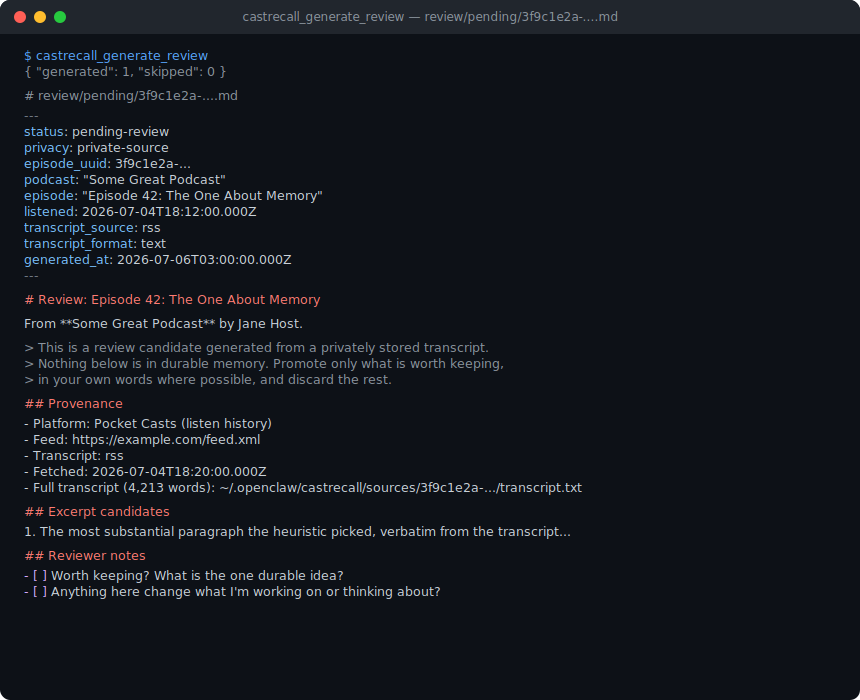

# CastRecall

Turn podcast listening into retrievable memory.

CastRecall is an open-source [OpenClaw](https://openclaw.ai) tool plugin that watches what you listen to, finds or generates the episode transcript, and stores it as **private, provenance-bearing source material**. Useful excerpts are surfaced as **approval-gated review candidates** — nothing is ever silently promoted into durable memory.

The first question it answers: **"What have I been absorbing lately, and how is it shaping my thinking?"**

## MVP scope

v0 is **Pocket Casts only** and **read-only**:

- Syncs your Pocket Casts listening history (never mutates playback state — no play/pause/star/seek tools exist).
- Resolves each listen to its canonical RSS feed item.
- Walks a cost-aware transcript ladder (see below).
- Stores full transcripts privately with a provenance sidecar.
- Generates markdown review candidates for human approval.

## ⚠️ The Pocket Casts caveat

**Pocket Casts has no official public API.** CastRecall uses the same reverse-engineered web-player endpoints as community tools such as [essoen/PocketCasts-mcp](https://github.com/essoen/PocketCasts-mcp) (prior art for this plugin). That means:

- It can break or be blocked by Pocket Casts at any time, without notice.
- It needs your account email and password (read-only requests only) — stored in the OS keychain when available, or env vars as a portable fallback. Accounts created via *Sign in with Google/Apple* have no password and won't work.
- If Pocket Casts ever ships an official API or export, CastRecall will move to it.

Use it with those expectations.

## Privacy model

- **Full transcripts are source material, not memory.** They live under CastRecall's private data dir with a `provenance.json` sidecar (`privacyClass: "private-source"`).
- **CastRecall never writes to durable OpenClaw memory.** It generates review candidates in `review/pending/`; a human decides what graduates — ideally rephrased in your own words — via `castrecall_resolve_review`, which writes promoted content only to the separately configured notes destination (`CASTRECALL_NOTES_DIR`). See "Resolving reviews" below.
- **Credentials are keychain-preferred, env-var fallback**: CastRecall reads Pocket Casts email/password from the OS keychain (macOS Keychain / libsecret) when a backend is available and entries exist, otherwise from `POCKETCASTS_EMAIL`/`POCKETCASTS_PASSWORD`. Either way, credentials never pass through plugin config and are never logged or echoed in errors. The Pocket Casts session token is cached (in memory, and in the keychain when available) and reused across syncs instead of re-sending the password every time; `CASTRECALL_DISABLE_KEYCHAIN=1` disables the durable keychain sink only (the in-memory, process-lifetime token cache always applies).
- Transcripts of published podcasts can still be copyrighted material — keeping them as private source data (rather than republishing or promoting them wholesale) is the intended use.

## CastRecall in the brain ecosystem

CastRecall is a **raw-source pipeline**, not a knowledge base of its own. It produces two lanes: immutable, provenance-bearing transcripts (the source layer) and approval-gated review candidates (curation input for a human to promote or discard). Neither lane is meant to be queried directly as "memory" — they're inputs to whatever markdown-based knowledge system you curate on top.

This mirrors [gbrain](https://github.com/garrytan/gbrain)'s own architecture exactly: an immutable `sources/` tree feeding agent-compiled brain pages. The same split applies just as well to Obsidian vaults, Karpathy-style personal wikis, or any other custom markdown corpus — CastRecall doesn't assume gbrain, it just happens to line up with it.

### Using CastRecall with gbrain

Once corpus-export mode is enabled, CastRecall's exported pages can reach a gbrain instance in one of two ways: dropped into gbrain's **watched inbox** for automatic pickup, or written directly into a brain's **`sources/` tree**, where each show's slug becomes its own two-segment prefix — which gbrain's LSD/brainstorm far-set selection treats as an automatic domain-bank bucket. See [Corpus export (gbrain & other markdown brains)](#corpus-export-gbrain--other-markdown-brains) below for the exact `CASTRECALL_EXPORT_DIR` setup and layout.

## Install

```bash
# from GitHub (current public install path)
openclaw plugins install git:github.com/comamitc/castrecall@main

# or from a local clone (for development)
git clone https://github.com/comamitc/castrecall
cd castrecall && npm install && npm run plugin:build
openclaw plugins install --link .
```

Then enable it if needed with `openclaw plugins enable castrecall`.

OpenClaw's current installer does not accept bare HTTPS GitHub URLs such as
`https://github.com/comamitc/castrecall`; use the `git:github.com/...@ref`
form above. That GitHub form is the current primary install path. Once
CastRecall clears ClawHub's publish review, the install target will be
`openclaw plugins install clawhub:comamitc/castrecall` (pending publish —
not yet live).

## First-run setup

Ask your agent to run `castrecall_setup` — it walks through everything below instead of you hand-editing config or JSON:

1. **Pocket Casts credentials** — explains what to set (`POCKETCASTS_EMAIL` / `POCKETCASTS_PASSWORD`), the unofficial-API caveat, and the Google/Apple-SSO limitation (those accounts have no password and can't be used). When an OS keychain backend is detected (macOS Keychain / libsecret), it also shows the exact `security`/`secret-tool` command to store credentials there instead — the safer option, with env vars remaining a fallback. Once configured, run `castrecall_setup({ verify: true })` to make one read-only Pocket Casts call confirming they actually work — the result reports success/failure and, on success, how many history entries are visible, never the credential values.
2. **Storage location** — where transcripts and review candidates live (`CASTRECALL_DATA_DIR`, default `~/.openclaw/castrecall`).
3. **Privacy defaults** — confirms transcripts are private source material, nothing is ever promoted into durable memory, and corpus export is off unless you opt in.
4. **Optional providers** — Taddy, local Whisper, and cloud STT, each with what's detected and how to enable it.
5. **Export directory** — off by default; if a gbrain install is detected (`~/.gbrain/`, or `CASTRECALL_GBRAIN_INSTALLED=1` set by an agent-driven wrapper that has confirmed the plugin via OpenClaw's own plugin inventory), `castrecall_setup` suggests its inbox as `CASTRECALL_EXPORT_DIR`.

`castrecall_setup` **never** modifies `openclaw.json` and **never** writes secrets to disk — it only tells you which environment variables to set and where (see `.env.example` for every variable). Re-run `castrecall_setup_status` any time afterward for a compact health report of the same state.

## Tools

| Tool | What it does |
| --- | --- |
| `castrecall_setup_status` | Setup/health report: configured providers, ladder availability, counts. Run first. |
| `castrecall_setup` | Guided first-run setup: walks through credentials (keychain-preferred, env-var fallback), storage, privacy defaults, optional providers, and export directory. `{ verify: true }` makes a read-only Pocket Casts test call. Never edits config or writes secrets itself. |
| `castrecall_sync_history` | Read-only Pocket Casts history sync; records new listens idempotently. Only episodes that pass the "meaningfully listened" filter are stored — see below. Keychain-preferred credentials with an env-var fallback; reuses the cached session token instead of logging in every sync. |
| `castrecall_recent` | Lists synced listens with transcript status and episode UUIDs. |
| `castrecall_fetch_transcript` | Runs the transcript ladder for one episode; stores transcript + provenance. Also exports markdown pages when `CASTRECALL_EXPORT_DIR` is set. |
| `castrecall_generate_review` | Writes approval-gated review candidates for stored transcripts. |
| `castrecall_resolve_review` | Disposition a pending review candidate (`promote` or `discard`) — call only after explicit human confirmation in conversation. See "Resolving reviews" below. |
| `castrecall_search` | Keyword/phrase search over stored transcripts. Every result carries provenance and an attributable snippet — see "Search" below. |
| `castrecall_digest` | Cross-episode digest over a recent time window: listening pattern, recurring topics, and notable excerpts, written as an approval-gated document — see "Cross-episode digest" below. |
| `castrecall_transcription_preflight` | Read-only preflight for corpus-scale local transcription (issue #55) — run this before `castrecall_run_pipeline` on a large batch. Reports episodes pending a transcript, the local Whisper backend/model and its quality tier, a rough runtime class, whether timestamps survive, whether paid cloud STT is enabled/configured, and whether it would block the run. Never mutates state — see "Corpus-scale transcription preflight" below. |
| `castrecall_run_pipeline` | Chains sync → fetch transcripts (new listens only) → generate reviews (episodes newly stored this run) → corpus export. Runs the corpus-scale transcription preflight first and blocks low-quality local generation for that run unless opted in — when paid cloud STT is also enabled, the same block skips it too, so the run never falls through to billed transcription. The tool a scheduler recipe should call — see "Scheduled / periodic sync" below. |

## Screenshots

CastRecall is a tool plugin with no GUI of its own, so the most honest
"screenshot" of the review flow is its actual output. `castrecall_generate_review`
writes one markdown file per episode to `review/pending/<episodeUuid>.md`:



```
$ castrecall_generate_review
{ "generated": 1, "skipped": 0 }
```

```markdown
---
status: pending-review
privacy: private-source
episode_uuid: 3f9c1e2a-...
podcast: "Some Great Podcast"
episode: "Episode 42: The One About Memory"
listened: 2026-07-04T18:12:00.000Z
transcript_source: rss
transcript_format: text
generated_at: 2026-07-06T03:00:00.000Z
---

# Review: Episode 42: The One About Memory

From **Some Great Podcast** by Jane Host.

> This is a review candidate generated from a privately stored transcript.
> Nothing below is in durable memory. Promote only what is worth keeping,
> in your own words where possible, and discard the rest.

## Provenance

- Platform: Pocket Casts (listen history)
- Feed: https://example.com/feed.xml
- Transcript: rss
- Fetched: 2026-07-04T18:20:00.000Z
- Full transcript (4,213 words): ~/.openclaw/castrecall/sources/3f9c1e2a-.../transcript.txt

## Excerpt candidates

1. The most substantial paragraph the heuristic picked, verbatim from the transcript...

## Reviewer notes

- [ ] Worth keeping? What is the one durable idea?
- [ ] Anything here change what I'm working on or thinking about?
```

You (or your agent) read the candidate, keep one durable idea in your own
words, and delete the rest — nothing here is ever auto-promoted.

## Resolving reviews

CastRecall's plugin has no approve/reject UI — **the conversation is the UI**.
An agent surfaces a review candidate in chat; you reply in natural language
with what to keep, rephrase, or discard; the agent then calls
`castrecall_resolve_review` to record your decision:

```
castrecall_resolve_review {
  episodeUuid: "3f9c1e2a-...",
  disposition: "promote",
  content: "The one durable idea, in my own words.",
  title: "Optional custom note title"          // defaults to the episode title
}
```

- **`promote`** requires `content` — the exact text you chose to keep.
  CastRecall writes it, verbatim, as a frontmattered markdown note under the
  directory set by `CASTRECALL_NOTES_DIR` (or the `notesDir` plugin setting),
  which is created on demand if it doesn't already exist. The note carries
  attribution (podcast, episode, listen date, transcript source, episode
  UUID) but never the full transcript or heuristic excerpts — only what you
  chose.
- **`discard`** needs no `content` and writes no note anywhere; it simply
  retires the candidate.

Either way the candidate moves from `review/pending/` to `review/resolved/`
and cannot be resolved again — a second call for the same episode throws.

**The gate is contractual, not technical.** CastRecall cannot verify a human
actually made the call in chat; `castrecall_resolve_review`'s tool
description instructs the calling agent to invoke it only after explicit
human confirmation, the same trust model as every other agent tool.
`castrecall_generate_review` itself remains structurally unable to promote
anything — it only ever writes to `review/pending/`.

## The transcript ladder

Before any rung runs, CastRecall resolves the podcast's RSS feed URL: first via the (unofficial) Pocket Casts feed-export endpoint, then by matching the podcast title against the iTunes Search API. If both miss and `LISTENNOTES_API_KEY` is set, it also tries Listen Notes' podcast search as a last resort — this is a feed-URL discovery fallback, not a transcript-ladder rung, since [Listen Notes' own docs](https://www.listennotes.com/api/docs/#get-api-v2-search) say under 1% of episodes have transcripts.

Cheapest and most open first; every rung reports why it hit, missed, or was skipped:

1. **RSS `<podcast:transcript>`** (always on, free) — the open [podcast namespace](https://podcastindex.org/namespace/1.0) standard. Supports plain text, HTML, VTT, SRT, and JSON transcripts, normalized to clean text with speaker labels where available.
2. **Taddy** (optional) — set `TADDY_API_KEY` + `TADDY_USER_ID` ([free signup](https://taddy.org/developers); podcast-provided transcripts may be available to free accounts, while generated/on-demand transcripts use Taddy plan credits).
3. **Podchaser** (optional) — set `PODCHASER_API_KEY` to a **bearer access token** minted once via Podchaser's `requestAccessToken` mutation ([auth docs](https://api-docs.podchaser.com/docs/authorization/); tokens last about a year), not a raw client secret. Looks up the episode by GUID (falling back to an exact title match), then fetches whichever declared transcript reference it prefers.
4. **Local Whisper** (free, fully private, auto-detected) — if a Whisper CLI is installed, CastRecall transcribes the audio on your machine at no cost. Detected binaries, in order: `whisper-cli`/`whisper-cpp` ([whisper.cpp](https://github.com/ggerganov/whisper.cpp), e.g. `brew install whisper-cpp`, needs a ggml model via `CASTRECALL_WHISPER_MODEL` and ffmpeg for non-WAV audio), `mlx_whisper` (Apple Silicon, `pip install mlx-whisper`), `whisper-ctranslate2`, `whisper` (openai-whisper). Or supply any command via `CASTRECALL_WHISPER_COMMAND="your-tool {input}"` (transcript on stdout). Nothing is bundled — when no CLI is found the rung is skipped with install hints.

   **Choosing a backend by platform.** On **Apple Silicon**, install `mlx-whisper` and set `CASTRECALL_LOCAL_WHISPER_PRESET` (below) — CastRecall's recommended local path there. For **whisper.cpp** (any OS, CPU-only), there's no preset shortcut: you must point `CASTRECALL_WHISPER_MODEL` at a ggml model file. On **CUDA/NVIDIA machines** (e.g. an RTX 5090), skip MLX entirely — its presets resolve to `mlx-community/...` models that only run on `mlx_whisper` — and instead let `whisper-ctranslate2` (the faster-whisper CTranslate2 CLI) auto-detect, setting `CASTRECALL_WHISPER_MODEL=large-v3` (or another size) directly; CastRecall passes no `--device` flag, so the CLI picks the GPU on its own. To pin the exact device/precision (`--device cuda --compute_type float16`) or to run **WhisperX** instead (not auto-detected), wire it through `CASTRECALL_WHISPER_COMMAND` — note WhisperX's CLI writes a transcript *file* rather than printing to stdout, so the command needs a wrapper that cats the result, e.g. `CASTRECALL_WHISPER_COMMAND='out=$(mktemp -d) && whisperx {input} --device cuda --compute_type float16 --model large-v3 --output_format txt --output_dir "$out" >&2 && cat "$out"/*.txt'`.

   On Apple Silicon (`mlx_whisper`), instead of naming a model yourself you can set `CASTRECALL_LOCAL_WHISPER_PRESET` to a CastRecall-managed quality preset: `best` and `balanced` both resolve to `mlx-community/whisper-large-v3-turbo` (the only preset today that's quality-approved for a transcript corpus; `balanced` aliases it and may diverge to a validated mid-tier model later), while `fast` is an *explicit* opt-in to the smaller, lower-quality `mlx-community/whisper-small-mlx` — never an accidental default. `mlx-community/...` models only run on `mlx_whisper`; presets are ignored (with an explanatory reason) on whisper.cpp/openai-whisper/whisper-ctranslate2 (including CUDA hosts) — see "Choosing a backend by platform" above for what to set there instead. `CASTRECALL_WHISPER_MODEL` always overrides a preset when both are set, and the concrete model actually selected is named in `castrecall_setup`/`castrecall_setup_status` before any corpus-scale transcription runs, and in the transcript's stored provider.

   **Decoding options (issue #53).** Whisper's decoding defaults were tuned for short clips, not long-form podcasts, and can produce repetition loops or hallucinated text on hour-long episodes. CastRecall defaults `condition_on_previous_text` to **off** (`CASTRECALL_WHISPER_CONDITION_ON_PREVIOUS_TEXT=false`) — the main driver of decode-time repetition loops, since it stops the model from feeding its own prior output back in as context — and exposes a handful of other options: `CASTRECALL_WHISPER_LANGUAGE` (skip language auto-detection when you already know it), `CASTRECALL_WHISPER_WORD_TIMESTAMPS`, `CASTRECALL_WHISPER_OUTPUT_FORMAT` (`txt` default, or `json`/`vtt`/`srt` for structured/timestamped output, normalized the same way RSS-sourced transcripts are), and `CASTRECALL_WHISPER_NO_SPEECH_THRESHOLD` / `CASTRECALL_WHISPER_LOGPROB_THRESHOLD` / `CASTRECALL_WHISPER_COMPRESSION_RATIO_THRESHOLD` / `CASTRECALL_WHISPER_HALLUCINATION_SILENCE_THRESHOLD` for hallucination/silence tuning. Every option maps to the concrete CLI flag for whichever flavor is detected (whisper.cpp maps word timestamps to its full-JSON `-ojf` output and the logprob threshold to `-lpt`); an option a flavor doesn't support (e.g. whisper.cpp has no `compressionRatioThreshold`/`hallucinationSilenceThreshold` flags, or word timestamps requested without JSON output) is **ignored with an explicit reason** rather than silently dropped or failing the run — surfaced in `castrecall_setup`/`castrecall_setup_status` and in the transcript-ladder rung detail on a hit. An unrecognized `CASTRECALL_WHISPER_OUTPUT_FORMAT` value falls back to `txt` the same way, with the ignored value named in that provenance. The custom-command flavor (`CASTRECALL_WHISPER_COMMAND`) ignores all decode options — you own the whole command line there.

   **Exact generation provenance (issue #54).** `local-whisper:mlx-whisper` alone hides the difference between `whisper-tiny` and `large-v3-turbo`, which made it too easy to miss that a corpus was generated with a poor default model. Every transcript's `provenance.json` therefore stores a `generation` object with the exact backend, concrete model/preset, applied and dropped decode options, stored output shape, whether word timestamps actually made it into the artifact, and (best-effort) the CLI's `--version` output. When no model is pinned and the backend quietly ran its own built-in default, `generation.modelSource` is `"backend-default"` and `generation.usesBackendDefault` is `true` — the auditable red flag for "this corpus may need re-transcribing at higher quality." Corpus export and generated review candidates both surface these fields — see "Corpus export" below and `castrecall_generate_review`'s output.
5. **Cloud speech-to-text** (optional, **costs money**, disabled by default) — enable explicitly with `CASTRECALL_ENABLE_STT=true`. Providers: **AssemblyAI** (default; transcribes straight from the audio URL), **OpenAI** (`gpt-4o-transcribe`; requires downloading and uploading the audio, 25 MB API limit), **Deepgram** (`nova-3`; also transcribes straight from the audio URL, with diarized speaker labels), or **remote-stt** (issue #61; a generic contract for your own private/self-hosted STT service — WhisperX, faster-whisper, or anything else — see "Remote STT contract" below).

### Remote STT contract (issue #61)

`CASTRECALL_STT_PROVIDER=remote-stt` lets CastRecall call any self-hosted STT service — WhisperX, faster-whisper, a bespoke GPU box, whatever — as long as it implements this contract. The transcript ladder calls it exactly like AssemblyAI/OpenAI/Deepgram, with no knowledge of which implementation is actually running. Set `CASTRECALL_REMOTE_STT_BASE_URL` (`{base}` below, trailing slash trimmed) to enable it; `CASTRECALL_REMOTE_STT_TOKEN` is sent as `Authorization: Bearer <token>` on every request when set.

- **Health** — `GET {base}/health` → `200` (optionally `{ "status": "ok", "implementation": "whisperx", "version": "1.2.3", "model": "large-v3", "model_ready": true, "capabilities": { "diarization": true, "timestamps": true }, "accepts": "audio_url" | "upload" | "both" }`) means ready, unless the body reports `"status": "degraded"` or `"model_ready": false`, or `accepts` names only the *other* submit mode than the one CastRecall is configured for — those are "degraded" (see below). `401`/`403` means unavailable due to auth; any other non-2xx or network failure means unavailable. Used by `castrecall_setup`/`castrecall_setup_status`/`castrecall_transcription_preflight`; never billed, never throws.
- **Submit** — `POST {base}/transcribe`. By default, JSON `{ "audio_url": "...", "model": "<optional CASTRECALL_REMOTE_STT_MODEL>" }`. With `CASTRECALL_REMOTE_STT_UPLOAD=true` (for providers that cannot fetch a remote URL themselves), CastRecall downloads the audio and instead sends `multipart/form-data` with a `file` field (+ `model`) — `audio_url` is not sent in this mode.
- **Response** — either the normalized result object directly (sync), or `{ "job_id": "...", "status": "queued" | "processing" }` (async), polled via `GET {base}/jobs/{job_id}` until `status` is `"completed"` (result read from `result`, falling back to the job body itself) or `"failed"` (terminal).
- **Normalized result**: `{ "text"?: string, "segments"?: [{ "speaker"?, "text", "start"?, "end"? }], "model"?: string, "implementation"?: string, "warnings"?: string[], "duration"?: number }`. `segments[].start/end` are seconds. `text` or non-empty `segments` is required; when `text` is absent it is synthesized from `segments`.

Failures classify the same way as the cloud providers: a rejected request or a `429`/`408`/5xx status is retryable (the episode stays eligible for a later run); `401` means the token was rejected; any other non-OK status, a body-level `"failed"` job, or the poll deadline elapsing are terminal. Every transcript's `provenance.json` records the remote `implementation`/`model` and the base URL's **host only** — never the token or the full base URL/path.

**Setup/status checks (issue #63).** `castrecall_setup`/`castrecall_setup_status` report the health check as one of three states: `ready` (reachable, model ready, compatible submit mode), `degraded` (reachable but the model isn't ready yet, the provider flagged itself `degraded`, or it only accepts the submit mode you're *not* configured for — the rung still runs), or `unavailable` (unreachable, or `401`/`403` — distinguished as "provider rejected the token" when `CASTRECALL_REMOTE_STT_TOKEN` is set vs. "endpoint requires auth but no token is set" when it isn't). `castrecall_setup_status` also exposes a structured `remoteStt` object (`state`, `reason`, `implementation`, `version`, `model`, `modelReady`, `capabilities`, `accepts`) alongside the prose summary — the bearer token is never included in either. A malformed `/health` body (non-JSON, or a field with the wrong type/enum value) is treated as `degraded` with a shape-specific reason rather than silently trusted.

**Corpus-scale reachability gate (issue #63).** When `CASTRECALL_STT_PROVIDER=remote-stt` is configured (base URL set) and a scheduled/batch run has `castrecall_transcription_preflight`'s corpus-scale threshold (5+) of episodes pending transcription, `castrecall_run_pipeline` probes the health check itself before that run. An `unavailable` result defers those episodes (`preflightDeferred`, not `failed` — no retry/backoff state is advanced, so they're immediately eligible again once the endpoint comes back) instead of letting them fall through to whatever ladder rung follows. A `degraded` result never blocks. Set `CASTRECALL_REMOTE_STT_ALLOW_UNVERIFIED=true` to explicitly bypass this gate for testing.

**Reference worker (issue #62, optional, GPU only).** `worker/whisperx/` is an optional, self-contained reference implementation of this contract — a Docker-first FastAPI service that runs [WhisperX](https://github.com/m-bain/whisperX) on your own NVIDIA/CUDA hardware. It's for power users who already have a CUDA machine and want private, high-quality transcription without forking CastRecall or writing a one-off script. **Nothing about it is required** — every other ladder rung and STT provider works with no GPU and no knowledge that `worker/` exists. See `worker/whisperx/README.md` for setup, the exact endpoint mapping, and a smoke test.

If no rung produces a transcript, the episode is marked `failed` with the per-rung reasons — no fake output, ever. Two exceptions stay `none` instead of failing outright, because the transcript may simply not exist *yet*: Taddy reporting the episode is actively transcribing, and an RSS feed item that currently declares no `<podcast:transcript>` links. Those episodes are automatically re-checked on later scheduled runs — see "Scheduled / periodic sync" below.

**Repetition-loop quarantine (issue #42).** As a backstop behind the decode-time mitigations above, every ladder source's output is checked for a repeated phrase or word loop before it's stored. A hit sets `transcriptStatus: "quarantined"` with the loop reason instead of storing the text — it's never searched, exported, or reviewed, and scheduled runs won't retry it (that would just re-run the same looping model). Re-run `castrecall_fetch_transcript` after changing `CASTRECALL_LOCAL_WHISPER_PRESET` or the STT provider to regenerate. `castrecall_setup_status`'s `counts.transcriptsQuarantined` and `pipelineErrors` surface these episodes.

## Transcript cleanup pass

Before a transcript is stored, `transcript.txt` gets a conservative, deterministic cleanup pass (on by default; set `CASTRECALL_TRANSCRIPT_CLEANUP=false` to disable it): standalone caption cues (`[MUSIC]`, `(inaudible)`, ...) and leading caption markers (`>>`, `- `) are stripped, glued/duplicated punctuation is de-glued (`word.Next` → `word. Next`, `word ,next` → `word, next`, `?.` → `?`), single-newline speaker turns are paragraph-separated, and whitespace is re-collapsed. It never adds punctuation that wasn't there, never rewrites, paraphrases, or summarizes, and never adds or removes a spoken word — the only tokens it can delete are the curated cue markers, and that's checked by a token-preservation invariant in `cleanup.test.ts`.

`raw.<ext>` is always the verbatim source, untouched by cleanup, so the pre-cleanup text is always recoverable by re-normalizing it. Every stored transcript's `provenance.json` carries a `cleanup: { version, applied }` field naming which transform steps actually changed the text (`applied: []` when the input was already clean) — omitted entirely when `CASTRECALL_TRANSCRIPT_CLEANUP=false`, so "ran, no-op" is distinguishable from "never ran."

## Proper-noun correction glossary

Off by default. Set `CASTRECALL_GLOSSARY_FILE` to the path of a JSON file to correct known STT mangling of product names, people, and company names — e.g. "chat gpt" → "ChatGPT" — after the cleanup pass runs. The file shape is:

```json
{
  "terms": [
    { "canonical": "ChatGPT", "variants": ["chat gpt", "chatgpt"] },
    { "canonical": "NASA", "variants": ["NASA"], "matchCase": true }
  ]
}
```

Each `variants` entry is matched as a whole token (case-insensitive by default; set `matchCase: true` for exact-case matching) — never a fuzzy or partial match, so `cat` never rewrites inside `category` and `Astral` never touches `Astralis`. When variants from different terms overlap (e.g. `"open ai"` and `"open ai labs"`), the longest match always wins, regardless of which term is listed first; the same variant string can never map to two different canonicals — a glossary file that does so fails to load. Corrections are applied once, in a single pass over the original text, so a corrected canonical is never re-scanned by another rule.

Applied corrections are recorded in `provenance.json` as `glossary: { version, corrections: [{ canonical, variant, count }] }` — present (even with `corrections: []`) whenever a glossary file is configured, omitted entirely when `CASTRECALL_GLOSSARY_FILE` is unset, so "ran, no matches" is distinguishable from "never ran." A malformed or unreadable glossary file fails `castrecall_fetch_transcript` outright, naming the file path, rather than silently skipping correction.

## Corpus-scale transcription preflight

Processing dozens of episodes with local Whisper can take hours, so CastRecall never starts that work silently. Before generating any transcripts, `castrecall_run_pipeline` computes a preflight from the same detection/model-resolution logic the ladder itself uses: how many synced episodes are still missing a transcript and could fall through to local generation, the selected backend and concrete model, whether that model is **quality-approved**, **low-quality**, or **unknown**, a rough runtime class (with an explicit "this is a rough estimate" caveat — no audio durations are known ahead of time), whether timestamps/segments will survive into the stored transcript, and that local audio is always temporary (downloaded to a temp dir, deleted right after transcription, never retained).

Call `castrecall_transcription_preflight` yourself any time to see this report before running a large batch — it's read-only and never mutates state. `castrecall_run_pipeline` runs the same check on every invocation: once at least `5` episodes are pending a transcript (a corpus-scale run, not a quick single-episode test) **and** the local Whisper rung would otherwise run at low quality (an explicit low-quality model, or `CASTRECALL_LOCAL_WHISPER_PRESET=fast`), that rung is skipped for the whole run with an actionable message — the free RSS/Taddy/Podchaser rungs still run for every episode as normal. The report's `sttFallback` field also names whether paid cloud STT is enabled/configured for this run; when it is, the same block **also** skips the STT rung (`sttFallbackBlocked: true`), so a blocked free-tier corpus run can never silently fall through into billed transcription instead. Opt in with `CASTRECALL_WHISPER_ALLOW_LOW_QUALITY=true`, or fix the model with `CASTRECALL_LOCAL_WHISPER_PRESET=best` (or `balanced`) — either one clears the local-Whisper block and, with it, the STT block. A config the ladder already skips for other reasons (e.g. mlx-whisper with no model and no opt-in, or whisper.cpp missing its ggml model) is reported, not double-blocked — it was never going to run anyway.

`castrecall_fetch_transcript` for a single episode is **never** gated by this — it always attempts local generation if the rung is otherwise ready, so a quick one-off test transcription stays exactly as easy as before.

## Search

`castrecall_search { query, limit? }` runs keyword/phrase search over every
stored transcript — the private corpus, never durable memory. `query`
accepts bare keywords and `"quoted phrases"`; a quoted phrase ranks a
transcript where the words appear in that exact order above one where the
same words are merely scattered across the episode. `limit` caps how many
results come back (default `10`, hard max `25`; `0`, a negative number, or
omitting it falls back to the default).

Every result carries full provenance so anything quoted stays attributable:

```json
{
  "episodeUuid": "3f9c1e2a-...",
  "podcast": "Some Great Podcast",
  "episode": "Episode 42: The One About Memory",
  "listenDate": "2026-07-04",
  "transcriptSource": "rss",
  "transcriptPath": "~/.openclaw/castrecall/sources/3f9c1e2a-.../transcript.txt",
  "score": 4.12,
  "snippet": "...the core idea is that **memory** is reconstructive, not a **recording**...",
  "snippetText": "the core idea is that memory is reconstructive, not a recording"
}
```

`snippet` is display-formatted (`**term**`-highlighted, `…`-elided);
`snippetText` is the exact, verbatim transcript slice it was built from.
Search is backed by a small on-disk index (term frequencies plus hash-keyed
positional postings) under `.index/search-index.v1.json` in the data dir —
private, rebuildable, and never containing the transcript word sequence.
It's reconciled automatically as transcripts are added or change; deleting
it just costs the next search a rebuild.

## Cross-episode digest

Everything else in v0 is per-episode. `castrecall_digest { days? }` answers the
aggregate question instead: *what have I been absorbing lately, and how is it
shaping my thinking?* It looks across every episode whose listen was first
seen within the window (default 30 days, `days` overrides it) and writes one
structural document to `review/pending/digest-<window>.md` — the same
approval-gated lane as `castrecall_generate_review`.

Like `castrecall_generate_review`, this is heuristic aggregation only: episode
and show counts, a transcript-source breakdown, recurring topics by term
frequency, and a handful of notable verbatim excerpts, each attributed to its
podcast and episode. It never fabricates themes or conclusions — a closing
"For the reviewing agent" section hands the actual synthesis to you (or your
agent), the same honesty split as every other CastRecall tool. Episodes you
listened to but never transcribed still count toward the listening pattern;
they just don't contribute topics or excerpts, since there's no transcript
text to draw from.

Re-running `castrecall_digest` with the same window never overwrites a
pending digest — it reports `alreadyExists: true` and points at the existing
file, just like review candidates.

## Listened-episode filter

Pocket Casts' `/user/history` endpoint returns everything you've opened, including episodes you only sampled or skipped through. `castrecall_sync_history` applies a "meaningfully listened" filter to that history **at ingestion time**, before an episode is ever recorded into CastRecall state:

1. `playingStatus == 3` (Pocket Casts marked it fully played) — always accepted.
2. Otherwise, if `duration` is known: accepted only if `playedUpTo / duration >= CASTRECALL_MIN_LISTEN_RATIO` (default `0.8`). A long episode with a low ratio is never rescued by the seconds floor below.
3. Otherwise (duration missing or unusable): accepted if `playedUpTo >= CASTRECALL_MIN_LISTEN_SECONDS` (default `300`).
4. If neither `duration`, `playedUpTo`, nor `playingStatus` is usable, the episode is skipped by default; set `CASTRECALL_RECORD_UNKNOWN_LISTENS=true` to record it anyway.

`castrecall_sync_history` reports `fetched`, `eligible`, and `skippedAsNotListened` counts so you can see how many history entries were filtered out. This filter only affects **newly ingested** episodes — it never deletes or re-evaluates episodes, transcripts, or review candidates already stored from a prior sync.

## Environment variables

| Variable | Required | Purpose |
| --- | --- | --- |
| `POCKETCASTS_EMAIL` / `POCKETCASTS_PASSWORD` | for sync, unless in the keychain | Read-only history access (unofficial API). Fallback when no OS keychain entry is found — see "Credential storage" below. |
| `CASTRECALL_DISABLE_KEYCHAIN` | no | `1` to disable the durable OS keychain sink (credential reads and token persistence). The in-memory, process-lifetime token cache still applies. |
| `CASTRECALL_SECRET_SERVICE` | no | Service name under which OS keychain entries are stored (default `castrecall`). |
| `CASTRECALL_DATA_DIR` | no | Data dir (default `~/.openclaw/castrecall`). |
| `CASTRECALL_HISTORY_LIMIT` | no | Max entries per sync (default 100). |
| `CASTRECALL_TRANSCRIPT_CLEANUP` | no | `false` to store `transcript.txt` exactly as normalized, with no cleanup pass (default `true`). See "Transcript cleanup pass" above. |
| `CASTRECALL_GLOSSARY_FILE` | no | Path to a JSON proper-noun correction glossary. Off by default. See "Proper-noun correction glossary" above. |
| `CASTRECALL_MIN_LISTEN_RATIO` | no | Minimum `playedUpTo`/`duration` ratio to accept a partial listen (default `0.8`). See "Listened-episode filter" above. |
| `CASTRECALL_MIN_LISTEN_SECONDS` | no | Minimum `playedUpTo` seconds to accept a listen when duration is missing (default `300`). |
| `CASTRECALL_RECORD_UNKNOWN_LISTENS` | no | `true` to record episodes with no usable duration/playedUpTo/playingStatus (default off — skipped). |
| `CASTRECALL_EXPORT_DIR` | no | Enables corpus export (markdown pages) to this directory. Off by default — see "Corpus export" below. |
| `CASTRECALL_NOTES_DIR` | for `castrecall_resolve_review` promote | Destination for notes promoted via `castrecall_resolve_review`. Created on demand. Not needed for `discard`. See "Resolving reviews" above. |
| `TADDY_API_KEY` / `TADDY_USER_ID` | no | Enables the Taddy ladder rung. |
| `PODCHASER_API_KEY` | no | Enables the Podchaser ladder rung. A bearer access token minted via Podchaser's `requestAccessToken` mutation — not a raw client secret. |
| `LISTENNOTES_API_KEY` | no | Enables the Listen Notes feed-URL discovery fallback (not a ladder rung), used only when Pocket Casts feed export and iTunes Search both miss. |
| `CASTRECALL_WHISPER_MODEL` | for whisper.cpp / mlx_whisper (recommended for whisper-ctranslate2 too) | Model to use, by platform: a ggml file path for whisper.cpp (e.g. `/path/to/ggml-large-v3.bin`), a model name for whisper-ctranslate2/openai-whisper — the CUDA/NVIDIA path, e.g. `large-v3` — or an `mlx-community/...` model for mlx_whisper (Apple Silicon). mlx_whisper otherwise defaults to the tiny model, so it's required there too unless `CASTRECALL_LOCAL_WHISPER_PRESET` or `CASTRECALL_WHISPER_ALLOW_LOW_QUALITY` is set. Always overrides a preset when both are set. **Avoid tiny/base ggml models** (e.g. `ggml-base.en.bin`) for corpus-scale transcription — they're low-quality and only appropriate for a quick smoke test. |
| `CASTRECALL_LOCAL_WHISPER_PRESET` | no | Apple Silicon (mlx_whisper) only: `fast`, `balanced`, or `best`. `best`/`balanced` resolve to `mlx-community/whisper-large-v3-turbo` (only `best` is quality-approved today); `fast` is an explicit opt-in to `mlx-community/whisper-small-mlx`. Ignored (with an explanatory reason) on other Whisper CLIs, including CUDA hosts running `whisper-ctranslate2` — those `mlx-community/...` models aren't valid there; set `CASTRECALL_WHISPER_MODEL` directly instead (e.g. `large-v3`). |
| `CASTRECALL_WHISPER_ALLOW_LOW_QUALITY` | no | `true` to let mlx_whisper run with its low-quality tiny-model default instead of requiring `CASTRECALL_WHISPER_MODEL` or a preset. |
| `CASTRECALL_WHISPER_COMMAND` | no | Custom local transcription command with an `{input}` placeholder; stdout = transcript. Ignores all `CASTRECALL_WHISPER_*` decode options below — you own the whole command line. |
| `CASTRECALL_DISABLE_LOCAL_WHISPER` | no | `true` to skip the local Whisper rung even when a CLI is installed. |
| `CASTRECALL_WHISPER_LANGUAGE` | no | Language hint (e.g. `en`) passed to the detected CLI. Unset = auto-detect. |
| `CASTRECALL_WHISPER_CONDITION_ON_PREVIOUS_TEXT` | no | Default `false` — CastRecall's loop-prevention default for long-form podcasts, since feeding prior output back as decoding context is a primary driver of Whisper repetition loops. Set `true` to opt back into the CLI's own default. |
| `CASTRECALL_WHISPER_WORD_TIMESTAMPS` | no | `true` for word-level timestamps where the flavor supports it. On whisper.cpp this maps to its full-JSON `-ojf` output, so it only applies when `CASTRECALL_WHISPER_OUTPUT_FORMAT=json`; otherwise ignored with a reason. |
| `CASTRECALL_WHISPER_OUTPUT_FORMAT` | no | `txt` (default), `json`, `vtt`, or `srt` for structured/timestamped output, normalized the same way RSS transcripts are. An unrecognized value falls back to `txt`, with the ignored value named in `castrecall_setup`/`castrecall_setup_status` and the rung detail. |
| `CASTRECALL_WHISPER_NO_SPEECH_THRESHOLD` | no | Numeric threshold for detecting silence/no-speech segments. An invalid (non-numeric) value is dropped (unset), not passed through as `NaN`. |
| `CASTRECALL_WHISPER_LOGPROB_THRESHOLD` | no | Numeric average-logprob threshold below which a segment is treated as failed. Maps to whisper.cpp's `-lpt`. Same invalid-value handling as above. |
| `CASTRECALL_WHISPER_COMPRESSION_RATIO_THRESHOLD` | no | Numeric gzip-compression-ratio threshold above which a segment is treated as failed (catches repetition loops). Not supported by whisper.cpp (ignored with a reason). Same invalid-value handling as above. |
| `CASTRECALL_WHISPER_HALLUCINATION_SILENCE_THRESHOLD` | no | Numeric silence-duration threshold (seconds) for hallucination suppression. mlx-whisper/openai-whisper/whisper-ctranslate2 only act on it alongside `CASTRECALL_WHISPER_WORD_TIMESTAMPS=true`; without that, it's ignored with a reason rather than silently having no effect. Not supported by whisper.cpp (ignored with a reason). Same invalid-value handling as above. |
| `CASTRECALL_ENABLE_STT` | no | `true` to allow paid STT fallback. |
| `CASTRECALL_STT_PROVIDER` | no | `assemblyai` (default), `openai`, `deepgram`, or `remote-stt`. |
| `ASSEMBLYAI_API_KEY` | with STT | AssemblyAI transcription. |
| `OPENAI_API_KEY` | with STT | OpenAI transcription. |
| `CASTRECALL_OPENAI_STT_MODEL` | no | Default `gpt-4o-transcribe`. |
| `DEEPGRAM_API_KEY` | with STT | Deepgram transcription. |
| `CASTRECALL_DEEPGRAM_STT_MODEL` | no | Default `nova-3`. |
| `CASTRECALL_REMOTE_STT_BASE_URL` | with remote-stt | Base URL of your self-hosted STT service — see "Remote STT contract". |
| `CASTRECALL_REMOTE_STT_TOKEN` | no | Sent as `Authorization: Bearer <token>` on every remote-stt request. |
| `CASTRECALL_REMOTE_STT_MODEL` | no | Model name/id forwarded to the remote-stt provider. |
| `CASTRECALL_REMOTE_STT_UPLOAD` | no | `true` to download the audio and multipart-upload it instead of submitting `audio_url`, for providers that cannot fetch remote URLs. |
| `CASTRECALL_REMOTE_STT_ALLOW_UNVERIFIED` | no | Testing only. `true` bypasses the corpus-scale reachability gate (see "Remote STT contract") that otherwise defers a large batch when the health check reports unavailable. |

Non-secret settings (`dataDir`, `historyLimit`, `sttEnabled`, `sttProvider`, `exportDir`, `notesDir`) can also be set via the plugin's config schema; env vars win when both are set.

## Credential storage

Pocket Casts credentials are resolved with **OS keychain precedence over env vars**:

1. **OS keychain** (macOS Keychain via `security`, or libsecret via `secret-tool` on Linux) — used when a backend is detected on `PATH` and both entries exist, under service `castrecall` (or `CASTRECALL_SECRET_SERVICE`), accounts `pocketcasts-email` / `pocketcasts-password`. `castrecall_setup` shows the exact command:

   ```bash
   # macOS
   security add-generic-password -U -s castrecall -a pocketcasts-email -w <email>
   security add-generic-password -U -s castrecall -a pocketcasts-password -w <password>

   # Linux (libsecret)
   secret-tool store --label "CastRecall pocketcasts-email" service castrecall account pocketcasts-email
   secret-tool store --label "CastRecall pocketcasts-password" service castrecall account pocketcasts-password
   ```

2. **`POCKETCASTS_EMAIL` / `POCKETCASTS_PASSWORD`** — the portable fallback when no keychain entry is found, or on hosts with no supported backend.

The Pocket Casts session token itself is cached and reused across syncs (skipping the login call) instead of re-sending the password every time, and is invalidated and refreshed automatically on a `401`. When a keychain backend is available, the token is also persisted there so it survives a process restart; otherwise it lives only in memory for the process's lifetime and is never written to disk. Set `CASTRECALL_DISABLE_KEYCHAIN=1` to disable the durable keychain sink entirely (no keychain credential reads, no keychain token persistence) — the in-memory cache still applies. A keychain read/write failure never blocks a sync; it degrades to the env-var fallback or a fresh login.

**Note (macOS):** writing the token to Keychain briefly exposes it in the process argument list (`security add-generic-password -w <value>`) — accepted for the short-lived session token; the Linux/libsecret path passes values via stdin instead, never argv. CastRecall never writes your email/password to the keychain itself — you do that yourself via the commands above.

## Corpus export (gbrain & other markdown brains)

CastRecall's primary intended downstream consumer is markdown-native idea-generation
tooling like [garrytan/gbrain](https://github.com/garrytan/gbrain)'s `lsd` /
`brainstorm` modes. Corpus export is an **opt-in** projection that, after a
transcript is stored, also writes it out as section-split, frontmattered
markdown pages — separate from (and never replacing) the private data dir.

Enable it by setting `CASTRECALL_EXPORT_DIR` (or the `exportDir` plugin
setting) to a directory. It is off by default; nothing is written unless one
of these is set.

**Layout:**

```
<export-dir>/podcasts/<show-slug>/<episode-slug>/
├── 01-<section-slug>.md   # ~1-2k words each, verbatim transcript text
├── 02-<section-slug>.md
├── ...
└── index.md                # episode index, links to every section
```

Each page's frontmatter: `title`, `show`, `episode`, `episode_url`, `audio_url`,
`listen_date`, `transcript_source`, `content_hash`, and `generated: false`
(this is verbatim transcript, not model output) — vendor-neutral fields that
also line up with gbrain's `media`/source conventions. When the transcript
came from local Whisper, exact generation provenance (issue #54) rides along
too: `transcript_backend`, `transcript_model` (omitted when the backend ran
its own default), `transcript_model_source`, `transcript_preset`,
`transcript_output_format`, `transcript_word_timestamps`,
`transcript_decode_options`/`transcript_decode_ignored` (JSON-encoded), and
`transcript_tool_version` — each omitted cleanly rather than emitted empty
when not applicable.

**Transcript quality score (issue #41).** Every stored transcript's
provenance carries a deterministic quality score so downstream consumers can
tell whether it's safe to quote, worth a review pass, or search-only —
factoring in empty/short output, repetition loops, lexical variety,
suspicious segment lengths, source confidence (machine transcription rungs
like local Whisper/cloud STT score lower than a published RSS/Taddy/Podchaser
transcript), and whether timestamps/speaker labels are present. It rides
along in corpus export as `transcript_quality_score` (0-100),
`transcript_quality_tier` (`quote-safe`/`reviewable`/`search-only`), and
`transcript_quality_reasons` (a JSON-encoded array of machine-readable codes,
e.g. `["no-timestamps","low-source-confidence"]` — empty array when nothing
was flagged). See `docs/ARCHITECTURE.md`'s `provenance.quality` fields for
the full scoring rules.

**Approximate timestamps (issue #43).** VTT/SRT/JSON sources carry per-segment
start/end timing, stored alongside the transcript in an optional
`segments.json` sidecar (plain text and other sources without segment timing
have no sidecar). When present, each section page's frontmatter gets quoted
`approx_start`/`approx_end` (`"HH:MM:SS"`), and `index.md`'s section links get
a ` — HH:MM:SS` suffix, letting search/review consumers jump back to
roughly where in the episode a passage came from. The mapping is
proportional and therefore approximate — never exact segment boundaries —
but always non-decreasing across sections; a section is simply left without
timestamps when the source has no timing signal there.

**Speaker labels (issue #44).** VTT/SRT/JSON sources and diarized cloud STT
(AssemblyAI/Deepgram) carry per-segment speaker labels in the same
`segments.json` sidecar. When at least one segment carries a non-empty
speaker, both the section and index frontmatter get a `speakers` line — a
JSON array of the distinct speaker labels in order of first appearance, e.g.
`speakers: ["Speaker A","Speaker B"]`. Labels are provider-given only, never
invented: a source with no speaker metadata (local Whisper, plain text) omits
the line entirely rather than fabricate a `Speaker 1`/`Speaker 2` split.

Export is idempotent: an episode whose transcript content hash hasn't changed
re-exports nothing — unless provenance now carries a quality score, segments
now carry timing, or segments now carry speaker labels, that the existing
export predates, in which case it re-exports once to backfill the
`transcript_quality_*`/`approx_start`/`approx_end`/`speakers` frontmatter even
though the transcript text itself is unchanged. It only ever reads a stored
transcript + its provenance sidecar (and the optional segments sidecar) —
review candidates and `state.json` are never exported.

**Two ways to point gbrain at it:**

- **Watched inbox** — point `CASTRECALL_EXPORT_DIR` at `~/.gbrain/inbox/`;
  gbrain's watched-inbox ingestion picks the pages up automatically.
- **Domain-bank bucket** — point it at a brain's `sources/` root
  (e.g. `~/.gbrain/sources`), *not* `sources/podcasts` — the exporter already
  adds its own `podcasts/<show-slug>/` prefix under whatever directory you
  point it at, so pointing at `sources/` yields `sources/podcasts/<show-slug>/`.
  Each show then gets its own two-segment prefix, which gbrain's
  LSD/brainstorm far-set selection treats as an automatic domain-bank bucket
  (it samples one far page per two-segment prefix; LSD adds stale-bias on
  top) — no gbrain-side registration needed.

## Data layout

```
~/.openclaw/castrecall/
├── state.json                    # sync state: seen listens, transcript status, schemaVersion
├── sources/<episodeUuid>/        # private source material
│   ├── raw.<ext>                 # transcript exactly as fetched/generated
│   ├── transcript.txt            # normalized, cleaned plain text (see "Transcript cleanup pass")
│   └── provenance.json           # platform, feed, URLs, timestamps, source, privacy class,
│                                  # quality score/tier/reasons, cleanup version/applied,
│                                  # contentHash, schemaVersion
├── review/pending/<episodeUuid>.md   # approval-gated review candidates
├── review/resolved/<episodeUuid>.md  # candidates moved out by castrecall_resolve_review
├── .staging/                     # reserved scratch for atomic writes — ignore it
└── .index/                       # reserved: castrecall_search's rebuildable index cache — ignore it
```

Promoted note *content* itself is written to the separate, user-configured
`CASTRECALL_NOTES_DIR` (see "Resolving reviews" above) — never into this data
dir, and never into durable OpenClaw memory.

`state.json` and `provenance.json` are a versioned, machine-readable
interface — see [docs/ARCHITECTURE.md](docs/ARCHITECTURE.md#data-dir-versioned-machine-readable-interface)
for the full field list and stability guarantees (episode/podcast UUIDs never
change; sidecars are write-once).

## Example workflow

> **You:** "Sync my podcast listens and prep reviews for anything new."
>
> **Agent:** runs `castrecall_sync_history` → 3 new listens. Runs `castrecall_fetch_transcript` for each (2 via RSS transcripts, 1 has none and STT is off). Runs `castrecall_generate_review` → 2 candidates in `review/pending/`.
>
> **You:** read the candidates, keep one durable idea in your own words, delete the rest.

## Scheduled / periodic sync

v0 sync is on-demand only unless you wire up a scheduler. `castrecall_run_pipeline` is the one
tool a scheduler recipe should call: it chains sync → fetch transcripts (new listens only) →
generate review candidates (episodes newly stored this run) → corpus export (when
`CASTRECALL_EXPORT_DIR` is set), with no human input, and is safe to invoke on an interval:

- **Concurrency-safe.** Overlapping runs use a lock (`.staging/pipeline.lock` under the data
  dir); a run that can't acquire it is a cheap no-op (`{ skipped: "locked" }`).
- **No API hammering.** Failures (missing/rejected credentials, the unofficial API being down)
  are recorded with a capped exponential backoff cooldown. A scheduled run inside the cooldown
  window is a cheap no-op (`{ skipped: "cooldown" }`) that makes **zero** Pocket Casts calls.
  Check `castrecall_setup_status`'s `sync` block for the current failure/cooldown state.
- **Cheap no-op when nothing's new.** A run that finds no new listens does no
  transcript/review/export work.
- **Corpus-scale transcription preflight (issue #55).** Before fetching any transcript, the run
  computes the same report `castrecall_transcription_preflight` returns and, once at least `5`
  episodes are pending a transcript and local Whisper would otherwise run at low quality with no
  opt-in, skips the local-Whisper rung for every pending episode this run — the result's
  `preflight` field reports the decision. See "Corpus-scale transcription preflight" above.
- **Availability re-check, not a webhook.** CastRecall is an OpenClaw tool plugin with no
  reachable inbound endpoint, so it cannot subscribe to Taddy's webhooks (the ideal, purely
  event-driven design). Instead, an episode whose only misses are "Taddy is actively
  transcribing this episode" or "the RSS feed currently declares no `<podcast:transcript>`
  links" stays `transcriptStatus: "none"` (not `failed`) and is automatically retried on a
  capped exponential backoff (hours, doubling up to a day) by every scheduled
  `castrecall_run_pipeline` run — no re-sync or manual `castrecall_fetch_transcript` call
  needed. After ~14 days with nothing appearing, the episode is marked terminally `failed`
  so a scheduler doesn't poll forever. **Trade-off:** an old RSS item that will never declare
  a transcript link stays `none` (not `failed`) for that entire 14-day horizon before
  converging — a deliberate choice to avoid missing episodes whose transcript link is added
  a few days after publish, at the cost of a stale `none` for those that truly never will.

### OpenClaw cron recipe

If your OpenClaw host supports scheduled/cron tool invocations, point it at
`castrecall_run_pipeline` with no arguments, e.g. every 30 minutes:

```yaml
# openclaw cron/heartbeat config (host-specific — adapt to your runtime)
- schedule: "*/30 * * * *"
  tool: castrecall_run_pipeline
  params: {}
```

### OS cron recipe

If your OpenClaw runtime doesn't own scheduling in your setup, drive it from OS cron via
whatever CLI/script can invoke a tool against your running agent:

```cron
# crontab -e — runs every 30 minutes
*/30 * * * * /path/to/your/openclaw-agent-invoker castrecall_run_pipeline >> /var/log/castrecall-pipeline.log 2>&1
```

**Never pass `force: true` from a scheduler recipe.** `force` bypasses the failure-cooldown gate
that exists specifically to avoid hammering the unofficial Pocket Casts API — it's for a one-off
*manual recovery run* only, invoked by a human who has just fixed the underlying problem (e.g.
rotated credentials).

**Crashed-run recovery is explicit, never automatic.** The run lock is heartbeat-renewed, so it
only ever looks stale after a hard kill (SIGKILL, power loss — normal failures release it). A
scheduled run that encounters a stale lock reports `skipped: "stale-lock"` with the lock's age
and does nothing — CastRecall never breaks a lock automatically, because no filesystem primitive
can do that without a window where two runs could both proceed. After confirming no run is
alive, recover with a one-off `castrecall_run_pipeline` call passing `breakStaleLock: true`
(refuses live locks; never set it in a scheduler recipe).

## Troubleshooting

- **"Pocket Casts credentials are not configured"** — set `POCKETCASTS_EMAIL` / `POCKETCASTS_PASSWORD` in the environment OpenClaw runs in (not just your shell), or store them in the OS keychain (see "Credential storage" above).
- **"Pocket Casts rejected the configured credentials"** — check them; Google/Apple-SSO accounts cannot be used (no password exists).
- **Login worked before but fails now** — the unofficial API may have changed or rate-limited you; wait and retry, and check the repo's issues.
- **"no-transcript" with all rungs missed/skipped** — the feed declares no transcript and no optional provider is configured. Install a local Whisper CLI (free), configure Taddy or Podchaser, or enable cloud STT.
- **Local Whisper skipped despite being installed** — the binary must be on the `PATH` of the environment OpenClaw runs in; check `castrecall_setup_status`, or point `CASTRECALL_WHISPER_COMMAND` at it directly.
- **"whisper.cpp needs a ggml model file"** — set `CASTRECALL_WHISPER_MODEL=/path/to/ggml-base.en.bin` (download via whisper.cpp's `models/download-ggml-model.sh` or Hugging Face `ggerganov/whisper.cpp`).
- **"whisper.cpp needs 16 kHz WAV input"** — install ffmpeg (`brew install ffmpeg`) so CastRecall can convert the episode audio, or use `mlx_whisper`/openai-whisper which decode audio themselves.
- **STT skipped even with a key set** — cloud STT must be explicitly enabled (`CASTRECALL_ENABLE_STT=true`); it costs money per episode.
- **Local Whisper (and, if enabled, paid cloud STT) skipped on a corpus-scale `castrecall_run_pipeline` run with "Corpus-scale preflight blocked"** — the run has 5+ episodes pending a transcript and the configured model is low-quality (e.g. `tiny`/`small`, or `CASTRECALL_LOCAL_WHISPER_PRESET=fast`). When `CASTRECALL_ENABLE_STT=true` is also set, the same block skips the STT rung too, so the run never falls through into billed transcription instead. Check `castrecall_transcription_preflight` for the exact reason, then either set `CASTRECALL_LOCAL_WHISPER_PRESET=best` (or `balanced`) or explicitly opt in with `CASTRECALL_WHISPER_ALLOW_LOW_QUALITY=true` — either one clears both blocks. A single-episode `castrecall_fetch_transcript` call is never affected by this.
- **OpenAI STT fails on long episodes** — the 25 MB upload limit; use `CASTRECALL_STT_PROVIDER=assemblyai` or `CASTRECALL_STT_PROVIDER=deepgram` (both transcribe straight from the audio URL, no upload limit here).
- **Want diarized speaker labels without polling** — `CASTRECALL_STT_PROVIDER=deepgram` transcribes straight from the audio URL and responds synchronously; very long episodes may still time out on Deepgram's side.
- **`remote-stt` shows "off — CASTRECALL_REMOTE_STT_BASE_URL is not set"** — point it at your self-hosted service; `castrecall_setup_status` also probes `GET {base}/health` once enabled and reports "remote NOT ready"/"remote degraded" with the reason when the service is down, rejecting the token, or reachable but not fully ready — see "Setup/status checks (issue #63)" above.
- **`castrecall_run_pipeline` defers episodes with `preflightDeferred` and remote-stt configured** — the corpus-scale reachability gate (issue #63) found the health check `unavailable`; fix the endpoint/token, or set `CASTRECALL_REMOTE_STT_ALLOW_UNVERIFIED=true` to bypass it for testing.
- **`remote-stt` transcription times out on a long episode** — the poll deadline (15 minutes by default) elapsing is treated as terminal, the same as AssemblyAI's poll timeout, so the episode is retried on the next scheduled run rather than left stuck mid-job.
- **Where did my data go?** — `castrecall_setup_status` prints the data dir.
- **How do I audit what actually produced a transcript after a run?** — run `castrecall_setup_status` to print the data dir, then open `sources/<episodeUuid>/provenance.json` under it (see "Data layout" above) and read its `generation` object, discriminated by `kind`. For `kind: "local-whisper"`: `backend`, `model`, `modelSource`, `usesBackendDefault`, `preset`, `outputFormat`, `wordTimestamps`, `decode.applied`/`decode.ignored`, and `toolVersion`. `usesBackendDefault: true` (equivalently `modelSource: "backend-default"`) is the red flag that no model was pinned and the backend quietly ran its own default — re-transcribe at higher quality. For `kind: "remote-stt"`: `implementation`, `model`, `baseUrlHost` (host only — never the token or full base URL), `mode` (`sync`/`async`), and `submittedBy` (`audio_url`/`upload`). The same fields ride along as `transcript_*` frontmatter on corpus-exported pages (see "Corpus export" above). Run `castrecall_transcription_preflight` before a large batch to catch this before it happens instead of after.

## Development

```bash
npm install
npm run typecheck   # tsc --noEmit
npm test            # vitest (547 tests: parsing, normalization, storage idempotency, corpus export, credential storage/session handling, periodic-sync pipeline, cross-episode digest, corpus-scale transcription preflight, error paths)
npm run plugin:build     # tsc + openclaw plugins build (regenerates openclaw.plugin.json)
npm run plugin:validate  # openclaw plugins validate
```

Architecture notes live in [docs/ARCHITECTURE.md](docs/ARCHITECTURE.md).

## License

[MIT](LICENSE)
